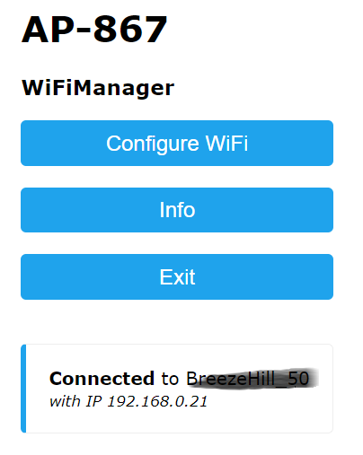
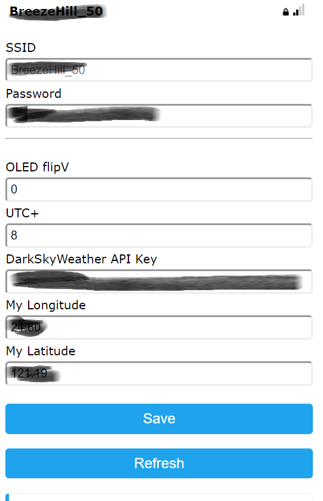

# Mega32 WeatherClock    

### WeatherClock firmware for Mega32 boards 
 
  

### WiFi manager!    ( main menu / config menu)  
   

  

### References
  - [PlatformIO](https://platformio.org/)  
  - [DarkSky Weather API](https://darksky.net/dev) 
  - [NTPClientLib](https://github.com/gmag11/NtpClient) 
  - [ESP Wifimanager](https://github.com/tzapu/WiFiManager)  
