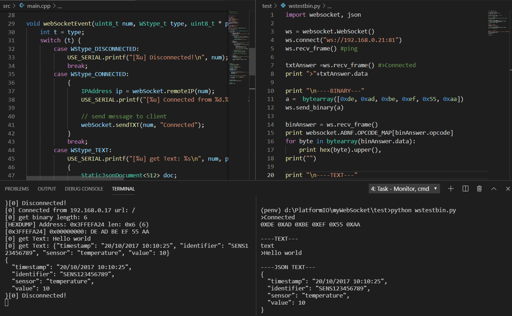

# Mega32 WebSocket    

### Websocket firmware for Mega32 boards 
 
  

### WiFi manager!    ( main menu / config menu)  
   

### Dependencies  
Dependency Graph 
|-- <ArduinoJson> 6.12.0 
|-- <WebSockets> 2.2.0 
|   |-- <ESP8266WiFi> 1.0         
|   |-- <Hash> 1.0 
|   |-- <Ethernet(esp8266)> 1.0.4 
|   |   |-- <SPI> 1.0 
|   |-- <SPI> 1.0 
|   |-- <ESPAsyncTCP> 1.2.0   
|   |   |-- <ESP8266WiFi> 1.0 
|-- <ESP8266WiFi> 1.0         
|-- <Hash> 1.0 

