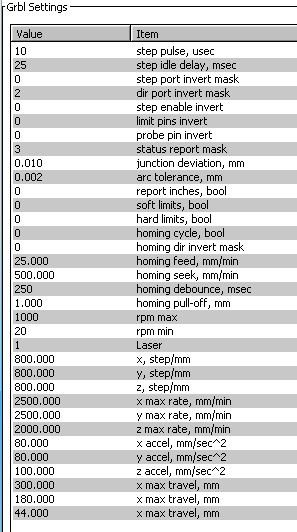

### My GRBL1.1 settings
Some good settings(size,speed,orientation) for the Grbl1.1 
 
    

### References
  - [How to set Steps Per Unit values? (Try&Error, Forget those terms! Quick&Easy)](https://planet-cnc.com/how-to-setup-cnc/)  
  - [GRBL official setting guide](https://github.com/gnea/grbl/wiki/Grbl-v1.1-Configuration)  
  - [Free Laser Engraving / Windows](http://lasergrbl.com/en/)  
  - [Engraver Master / Windows](http://www.bachinmaker.com/wiki/doku.php?id=engraver_master) 
