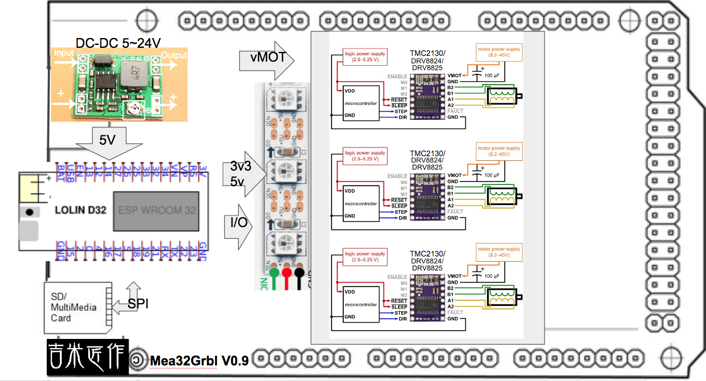
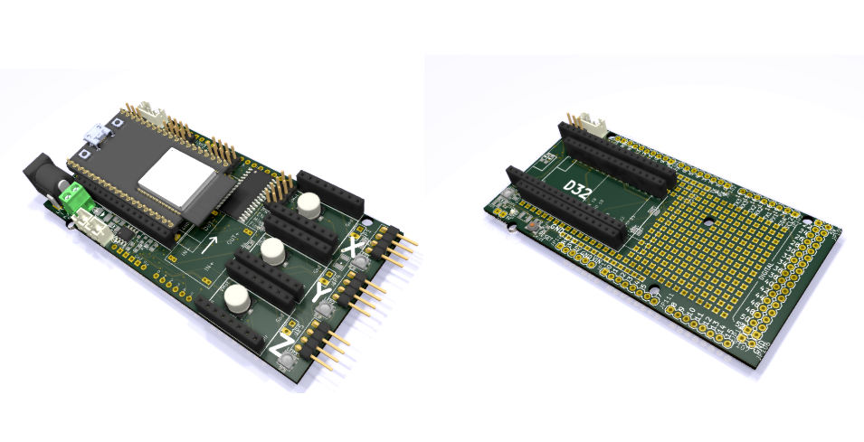
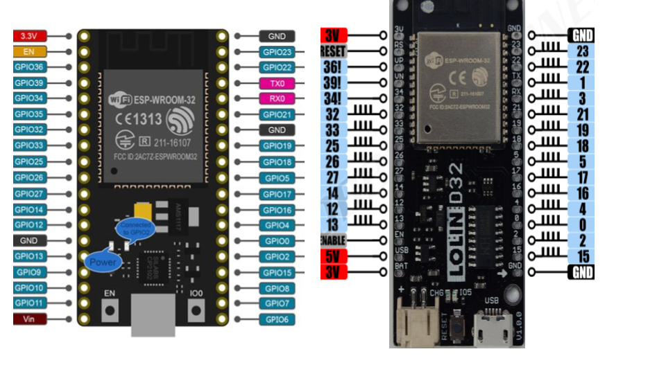
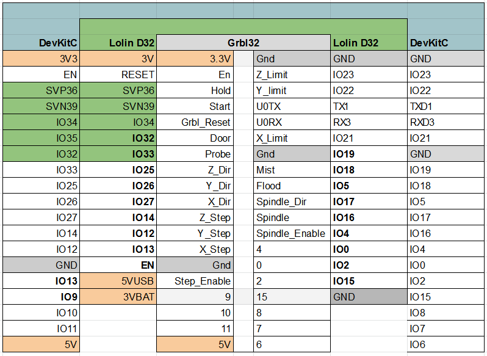
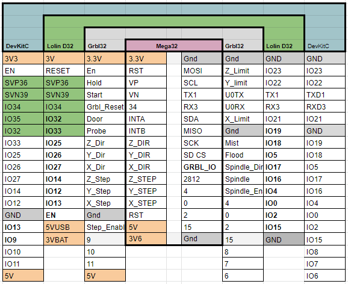

# Mega32Grbl    

An ESP32 Grbl board w/ Arduino Mega/R3 formfactor! (Not validated yet!) 
 
  
  

Two ESP32 modules supported! ( ESP32-DevKitC 38pin-1.1" / Lolin-D32 32pin-1")  
  

ESP32 GRBL CPU/IO mapping  
Mega32 CPU/IO mapping  
  

### References
  - [GRBL](https://github.com/gnea/grbl/wiki)  
  - [ESP32 GRBL](https://github.com/bdring/Grbl_Esp32)  
  - [The WiFi ESP3D-WebUI](https://github.com/luc-github/ESP3D-WEBUI)
