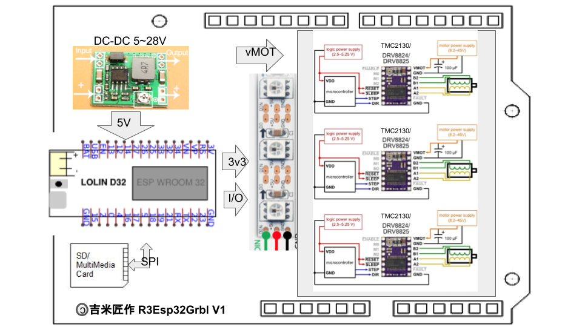
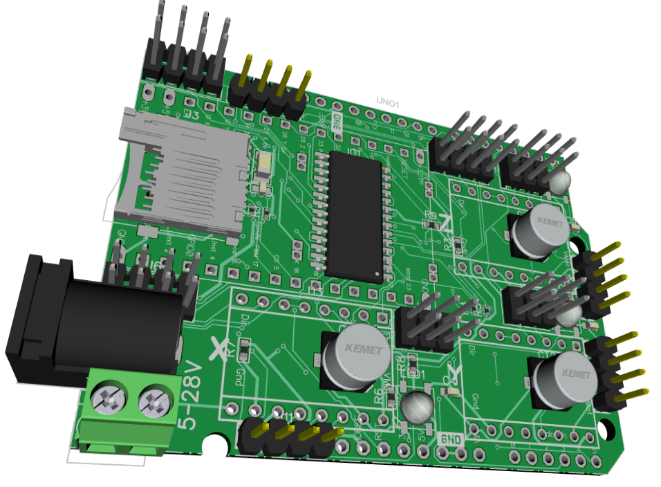

# R3Esp32Grbl
An ESP32 Grbl board w/ Adduino R3 formfactor! (Not validated!)

  
(Mega32Grbl.png)(Mega32Shield.png)

 
 

### References
  - [GRBL](https://github.com/gnea/grbl/wiki)  
  - [ESP32 GRBL](https://github.com/bdring/Grbl_Esp32)  
  - [Diptrace](https://diptrace.com/)  
