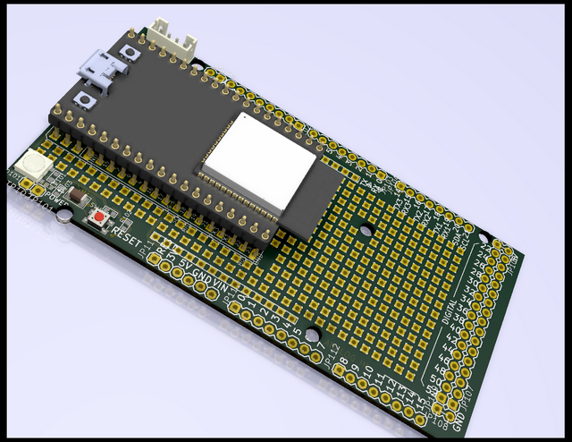

# Mega32Grbl
An ESP32 Grbl board w/ Adduino Mega/R3 formfactor! (Not validated!) 

  
  

 
 

### References
  - [GRBL](https://github.com/gnea/grbl/wiki)  
  - [ESP32 GRBL](https://github.com/bdring/Grbl_Esp32)  
  - [The WiFi WebUI](https://github.com/luc-github/ESP3D-WEBUI)
