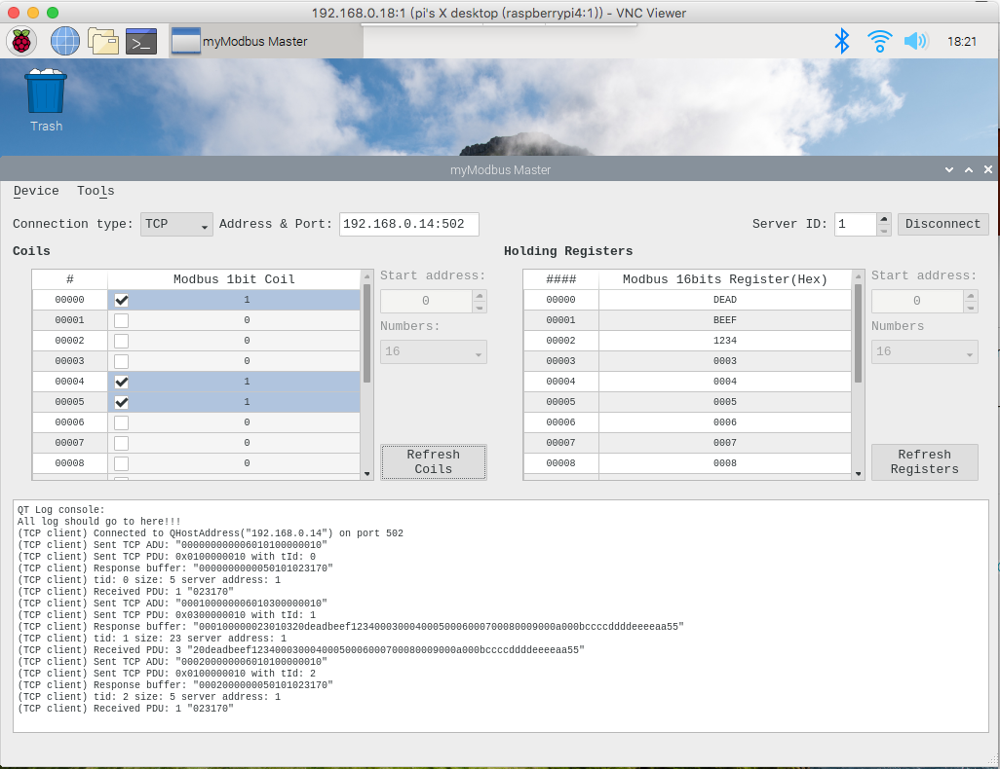

# myModbusMaster   

TCP ModbusMaster App w/ Qt5 for JimmyCraft Modbus 
Adapted from Qt Modbus example, limit to Coil/HoldingRegister read/write (0~16)  
Works on Windows, MacOS and Linux 
(For RPi, use apt to install _qt5-default, qtcreator, libqt5serialport5-dev, libqt5serialbus5-dev_)  <br?
  

  
